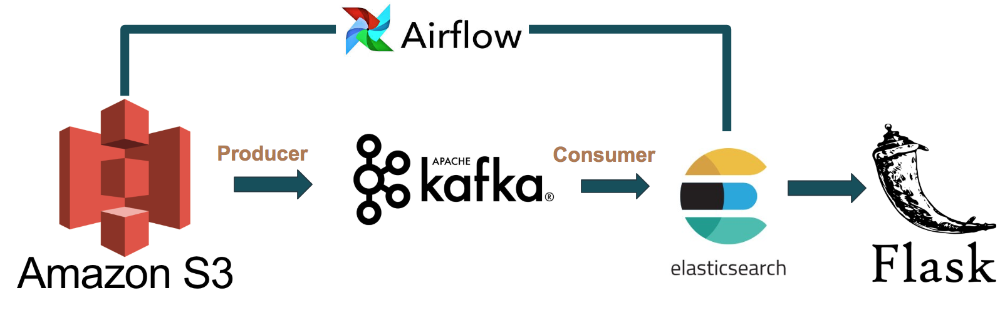

Project Idea: To develop a search engine that helps to search for latest news and also implement scheduling.

Purpose and use case: The purpose is to search for latest news and see the results according to relevance. The use case is to search and find the latest news from around the world.

Technologies: 1.Kafka 2.Airflow 3.Amazon S3 4.Elastic Search 5.Flask.

Proposed architecture: Amazon S3 -> Kafka -> Elastic Search -> Flask.

Challenges:

To automate the project.
To scale the system.

# NewsSearch: Insight Data Engineering Project

## Summary
An application to search for real-time news articles.

## Motivation
To create a scalable architecture to process huge volumes of incoming data streams and provide search results are quickly as possible.    

## Pipeline

The data I used is from the GDELT 2.0 dataset which is updated every 15 minutes in an Amazon S3 bucket. The data is ingested using Kafka into Elasticsearch where I ran search queries. To make the application real-time the data is ingested every 15 minutes which was scheduled with Airflow.

## Challenges
To build a performant, scalable and automated data pipeline. 

The project slides can be viewed [here](http://bit.ly/newsSearchppt).

The demo can be viewed [here](http://bit.ly/newsSearchdemo).
